### **LINK TO GITHUB REPOSITORY**
* [Github - LaylaD4/LaylahDePaull_T1A3](https://github.com/LaylaD4/LaylahDePaull_T1A3)

### **LINK TO YOUTUBE PRESENATION**
* [Youtube - Terminal Application Powerpoint Presention](https://www.youtube.com/watch?v=LRwAXorQLbs)

### **LINK TO TRELLO IMPLEMENTATION PLAN & SCREENSHOTS**
* [Trello Board - Terminal Application](https://trello.com/b/rre0vKEN/terminal-application)


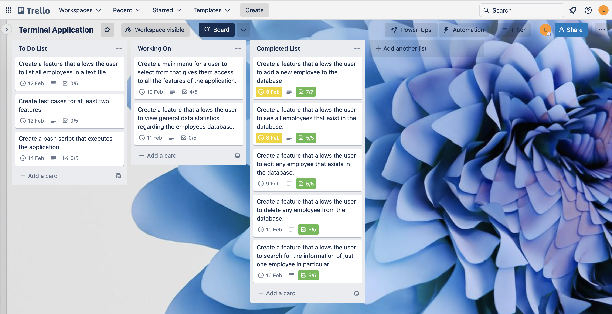<br>


### **CODE STYLING CONVENTIONS APPLICATION WILL ADHERE TO**

To make my code as comprehensible or 'readable'  as possible; not on for my benefit, however for the benefit of others reading my code. I will endeavour to adhere to the python styling guide conventions laid out in *PEP 8*. PEP 8 documentation plays a key role in providing python developers with the fundamental core style conventions that the majoity of Developers agree upon today to abide by. That is; to produce code that is more efficient, and very importantly most readable. Especially since: *"Using a disciplined style of programming will save you time whenever you have to read your program or debug it."*[1]

- **Naming conventions used for functions, classes, variables, & parameters**: For functions, variables, & parameters I have used all lowercase letters with underscores between words. For my class I have used the 'CapWords' style, that is; the class name starts with a capital letter. For all: functions, classes, variables, & parameters, I have used names that describe as accurately as possible what their intended purpose is (functions, classes), or what they are intend to contain (variables, parameters). I have deliberately steered clear of naming or  prefixing any function, class, variable, or parameter with any python keyword, and have avoided using variables or parameters that use single characters such as: lowercase: 'l', & uppercase 'O' or 'I', as they could easily be misinterpreted, and cause issues down the line.

- **Import conventions used**: All 'imports' I have used to import certain modules; sit a top of the python script they are being used in, as is the expected convention regarding order in a script. I have also purposely separated each individual import onto a different line, as is best practice. For the same module however, imports sit on the same line, and are separeted by comma's, in addition to that, they have been deliberately listed below whole module imports, as is standard convention regarding order in a python script.


- **Comment conventions used**: All comments I have used serve not to contradict my code, but to enhance the readers understanding of it. I have purposely adhered to single-line comments or *statement-comment's* when describing any blocks of my code. I have also intentionally steered clear of using any inline-comments in my code, as is best practice, and should be avoided where possible. All comments given are seated above the code being described.

- **Docstring conventions used**: For larger multi-line commentary of my code, I have used docstrings to accurately descible how my code works, and identify any specifications in my code, such as in functions; a desription of the parameters used. Any doctring used has been formatted correctly, that is; using three double quotes ("""), a basic description given on the first line, followed by the requisite blank line, with the larger more detailed specifications coming later. All doctrings sit just below, and indented in functions/classes definition line. *Note: PEP 257 guidelines used here*.

- **Blank line & whitespace conventions used**: I have purposely avoided using any unnessary blank lines or whitespaces in my code. For functions and classes, I have used two blank lines of separation. Regarding whitespaces, I have made certain all lists, arguments, parameters etc. have no redundant whitespaces. For indenting code, I have used four spaces, instead of a tab, as is best practice.

- **Maximum line length conventions used**: Where possible I have endeavoured to adhere to the custom length of 79 characters per line of code, as to avoid my code being wrapped by text editors in unfavourable locations that make the code less readable.

    [1], [2], [3], [4]


### **ATTRIBUTION TO REFERENCED SOURCES**

1. [Python Programming Style](https://www.cs.cornell.edu/courses/cs1110/2022fa/materials/style/)
2. [About Docstrings & Standards](https://pandas.pydata.org/docs/development/contributing_docstring.html#:~:text=A%20Python%20docstring%20is%20a,html%20documentation%20automatically%20from%20docstrings.)
3. [PEP 257 – Docstring Conventions](https://peps.python.org/pep-0257/)
4. [PEP 8 – Style Guide for Python Code](https://peps.python.org/pep-0008/)

### **FEATURES OF APPLICATION**
The 'features' or elements listed in the: *'Descriptive overview...'* are an accurate representation of the the functionality that is built into my terminal application. I thought it necessary to include a description of all elements that exist in my application to give the reader context, that is; a full picture of the mechanics of my application. Therefore, I have integrated those features that are 'technically' features into the descriptive overviews below of elements in my app, for the readers ease in understanding the general scope of my work. It is important to note; that not all the elements and their functionality included in my application fufil all three language elements, and concepts of: *'variable scope'*, *'loops & control structures'*, and *error handling*. That is, in particular; 'error handling'; as in some cases due to external imports such as: *'Inquirer'*[iii] have negated the need for *'error handling'* logic to be applied. However most do, and this will become evident in the descriptions made below, and directly pointed to in the summing up of the description.

<span style="text-decoration:underline;">*General concept of my terminal application:*<span>

My terminal application is essentially a *'Database'* in which a human resources manager, or some other employment manager could access to organise the employees that work for that particular company. The database (list) stores information (attributes) on current employees that work there for a manager to; view, alter, print, and gain access to general employee statistical data.

<span style="text-decoration:underline;">*Descriptive overview of the technical features integrated into the general functionality of my application through elements:*<span>


1. **Main menu**: Allows a manager to search through a menu, that lists all the functionality or options the application has to offer them. Together with the python library of *Inquirer*[iii] that gives the main menu its ease of navigation through menu items using only arrow keys, and a series of local variables used to store pertinent menu information. It also uses a conditional control structure (If statement) to direct which function is called, ergo; which option is selected. Options that can be selected include: *Display all Employees, List an Employee, Create an Employee, Edit an existing Employee, Delete an existing Employee, Employee Data Statistics, Print Employee List to File, & Exit Database.*<br>
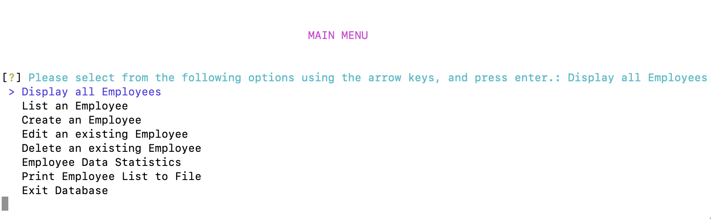<br>     
2. **Create an employee**: Allows a manager to add an entirely new employee to the database (*employee_list*) of existing employees. An employee is instantiated using the defined attributes; *name, age, role, & salary*, that are initialised in the *Employee* class. All inputs for attributes are stored in local variables, and use other functions that verify correct string (*check_for_valid_string, only_letters*) & number (*check_for_valid_number, handle_number_errors*) inputs using conditionals, loops, and error handling logic. The instance of that employee just created is added to a global variable: *employee_list* that serves as the employee database that stores all existing employee data (attributes). That employee just created by the user is then returned using a loop, and serves as the argument for another function (*list_employee*) that is designed to cogently reflect that instance of an employee just created.A user may return back to the main menu anytime they chose using the function call: *ask_return_main_menu*.<br>
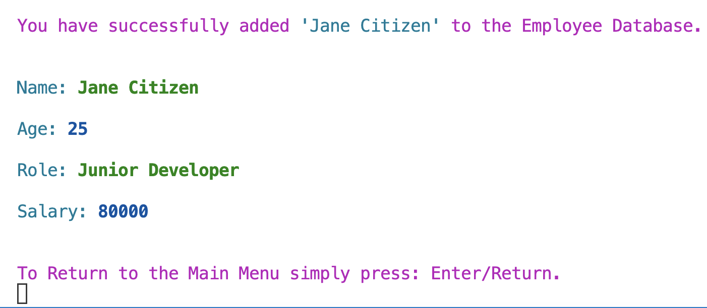<br>
  3. **Edit an employee**: Allows a manager to edit any attribute (*name, age, role, salary*) of an employee that exists in the employee database (employee_list). To edit an existing employee, the user is first faced with a list of names of current employees to select from due to the '*employee_search*' function call. Again, with the use of: *Inquirer*[iii] and a series loops and conditionals; a list of names or options are generated for the user to easily navigate through using only arrow keys; 'up or down'. The selection made is captured in a local variable that then can then be used as the argument for another function (*edit_employee_attributes*) which is called when a condition is met. The user has the choice to alter any attribute they wish, while conserving those they don't wish to alter; depending on their input or lack thereof (empty string). This functionality is controlled by a series of conditionals, function calls, and error handling logic; that includes loop conditionals to deal with empty strings, and input that is incorrectly entered (letters/numbers). Any newly edited input (non-empty string) stored in local variables serve to reset that employee instance and their requisite attribute/s when a condition is met. The newly edited employee is then used as the argument for another function (*list_employee*) that is designed to clearly reflect that newly edited instance of an employee. After an employee is successfully edited, the user is returned back to the initial list of names of current employees with the function: *edit_employee* being re-called. There they can choose to edit another employee, or return back to the main menu.<br>
  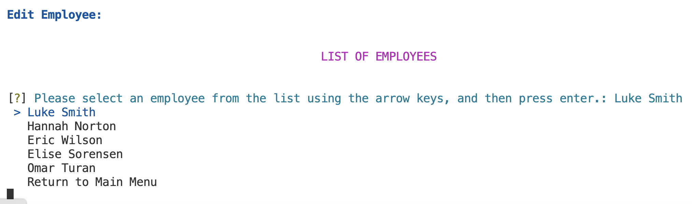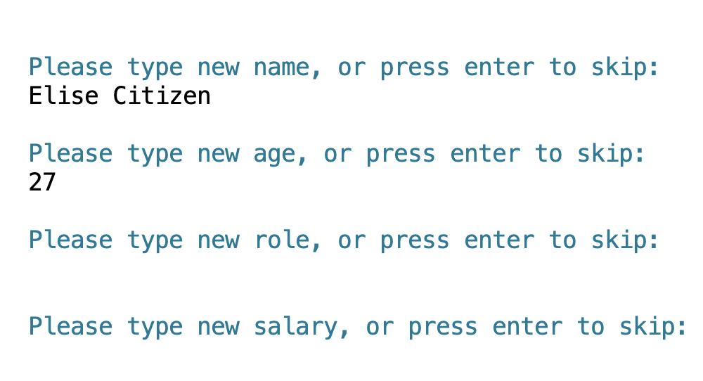<br>
  4. **Display all employee's**: Allows a manager to view all the current employees, and their associated attributes (*name, age, role, salary*) that exist in the employee database (*employee_list*) in a table format, with the use of the python library import: *Rich*[iv]. The *Rich* python library allows for the addition of columns and rows to be added using different function calls, and also allows for the table to be styled with a 'ruleset' similar to that of CSS syntax. Therefore, using *Rich* function calls, together with a loop that iterates through the global variable: *employee_list* (employee database), this feature is able to print out a uniquely designed table that lists all currently existing employees in the database, and their associated attributes. A user may return back to the main menu anytime they chose using the function call: *ask_return_main_menu*.<br>
  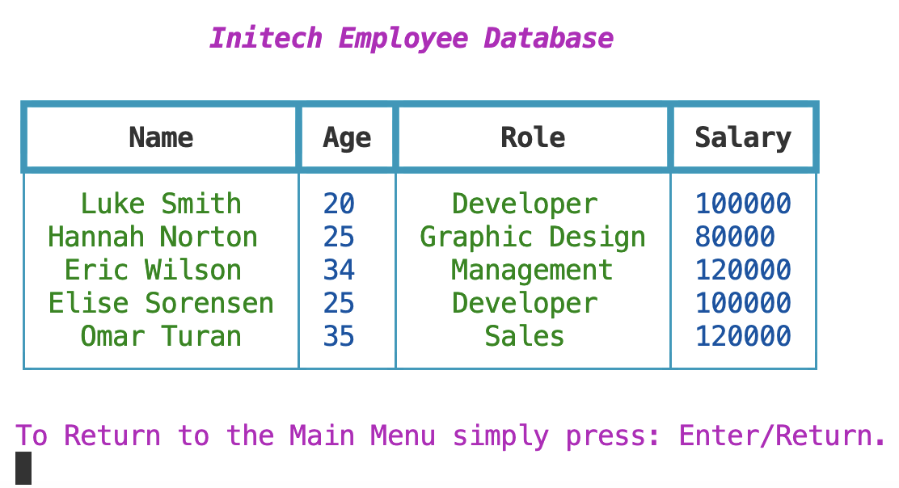<br>
  5. **List an employee**: Allows a manager to view just the one current employee of interest in the employee database (*employee_list*), and their attributes of; *name, age, role*, and *salary*. To view an existing employee, the user is first faced with a list of names of existing employees to select from due to the '*employee_search*' function call. Again, with the use of: *Inquirer*[iii] this list of names, or options are easily navigated using only arrow keys; 'up or down'. The selection made is captured in a local variable that can then be used as the argument for another function (*list_employee*) which is called when a condition (If statement) is met, and prints the selected instance of an employee out to the terminal in a clear and concise manner.After an employee is successfully listed, the user is returned back to the initial list of names of current employees with the function: *list_one_employee* being re-called. There they can choose to list another employee, or return back to the main menu.<br>
  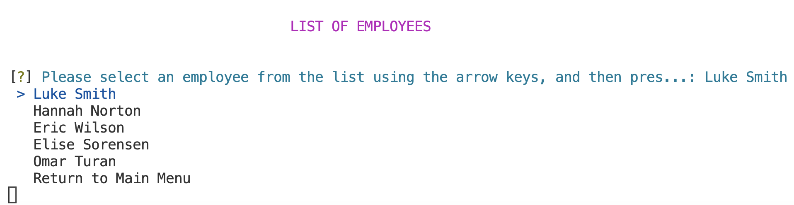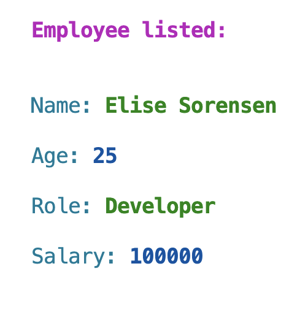<br>
  6. **Delete an employee**: Allows a manager to delete any existing employee from the employee database (*employee_list*) in it's entirety. That is; the employee, and all of their associated attributes of; *name, age, role,* and *salary*. To delete an existing employee, the user must first inspect a list of names of existing employees to select from using the '*employee_search*' function call. Again, with the use of: *Inquirer*[iii] this list of names, or options are easily navigated using only arrow keys; 'up or down'. The selection made for deletion is then captured in a local variable that is used as an argument for the remove method if a condition is met (If statement). The remove method is applied to the global variable of *employee_list* (database) which then makes the subsequent deletion of that employee instance. To inform the user of the successful deletion, a print statement is used, along with a function (*list_all_employees*) call that prints a table that lists all currently existing employees in the database (minus the employee).After an employee is successfully deleted, the user is returned back to the initial list of names of current employees with the function: *list_one_employee* being re-called. There they can choose to delete another employee, or return back to the main menu.<br>
  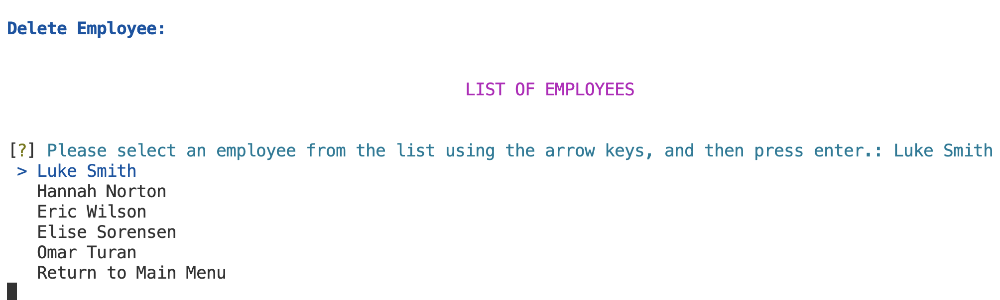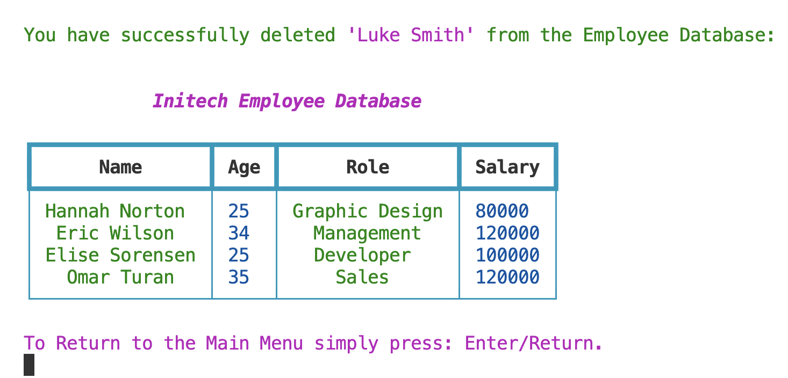<br>
  7. **Employee data statistics**: This allows the manager to be apprised of three different general employee data points, that is; *'the number of employee's* (*display_number_of_employees*), *the average age of an employee* (*calculate_avg_age_of_employees*), and *the average salary of an employee* (*calculate_avg_salary_of_employee*) working at that particular company. The user is able to make a selection of the above available data points, with the use of: *Inquirer*[iii] that lists these data points as options in a list that can be easily navigated using only arrow keys; 'up or down'. The selection made meets a condition (If statement), and allows for the subsequent function to be called. That is; if a user selects: '*Calculate Average Age of an Employee*'; the calculate_avg_age_of_employees function will be called. All three selections and their associated functions make use of local and global variables (*employee_list*) to make their calculations. Loops are used to retrieve necessary information (eg; 'ages') from the database (*employee_list*), error handling is used to prevent any 'TypeErrors' that could occur during calculations, and finally a print statement is used to return the result for the user to observe.After a data point is successfully returned, the user is returned back to the initial list of general employee data points with the function: *data_statistics_search* being re-called. There they can choose to return another data point calculation, or return back to the main menu.<br>
  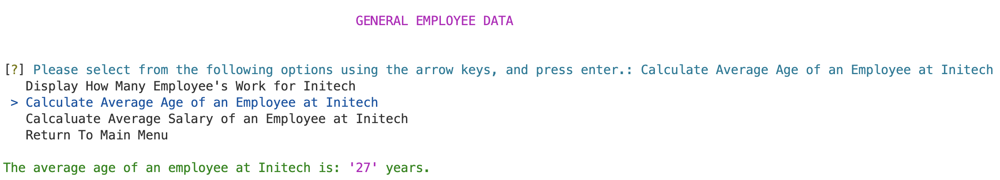<br>
  8. **Print employee database**: This allows the manager to print the current employee database, that includes the names of all employees and their associated attributes to a text file (list_of_employees.txt), and the terminal. This list also provides a timestamp of when it was printed, and a count of the number of employee's listed. The text file is written using a series local variables, inbuilt python module functionality (*open/close*, *write*, *date.today*, and *os.system*), and finally a global variable (*employee_list*) that is looped through to obtain all employee's that exist in the database (*employee_list*) to be printed out.<br>
  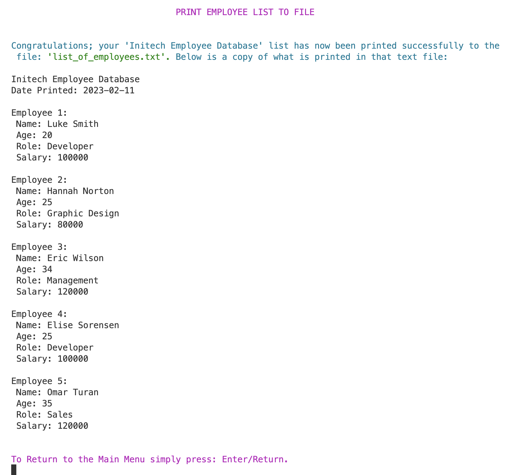<br>
  8. **Exit database**: This allows the manager to exit the 'Employee Database' when they are through making any of the necessary; additions, alterations and/or observations to it. When a user chooses to exit the database, they are informed of this by a print statement that identifies their name, and the fact that they are: ‘*Logged Out*’. This statement also includes the date in which the user has logged out, & a print out copy of: *list_of_employees.txt*. Finally a simple call of the python inbuilt function of: *'exit()'* ends the application.<br>
  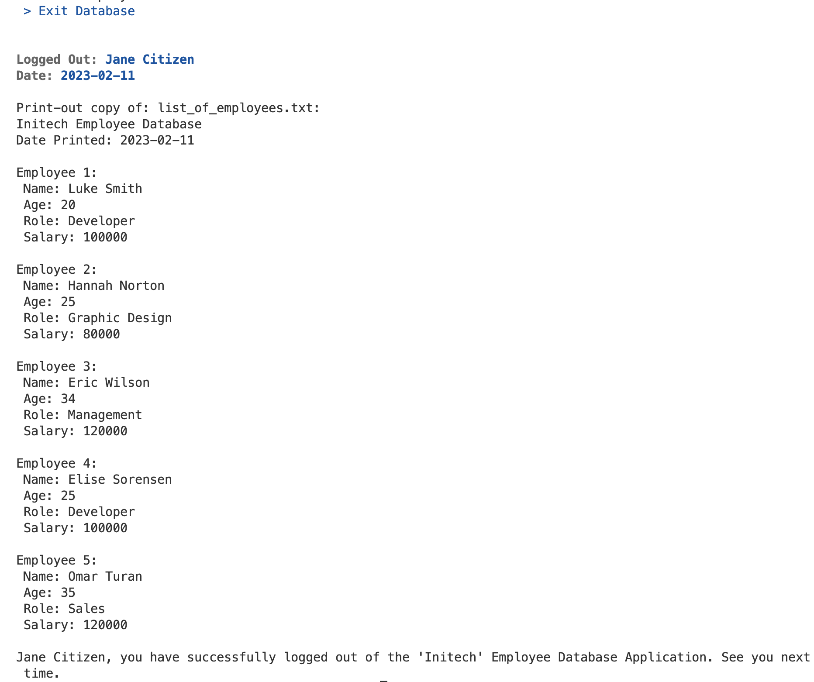<br>
  
  Therefore in summing; within the functionality of my application, there are at least; *seven* functions that stand out to be 'technical' features according to the requirements of: *'variable scope'*, *'loops & control structures'*, and *error handling*. That is; *create_employee, edit_employee_attributes, display_number_of_employees, calculate_avg_age_of_employees, calculate_avg_salary_of_employee, check_for_valid_number, and check_for_valid_string*. All 'technical' features are therefore described in the overview of elements above regarding the general functionality of my app. Thereby, making evident the meeting of the requirement of at least three features that demonstrate my understanding of: all three language elements, and concepts needed.


### **HELP DOCUMENTATION**

-**Steps to install the application**:
1. Open your terminal. If your terminal is not in your Mac's dock. You can do a 'spotlight search' by hiting:
```
command + spacebar
```

2. Navigate to your 'Desktop' directory in your terminal, then copy and paste the following command into your terminal:
```
cd Desktop
```

3. Now, to install the application, copy and paste this next command into your terminal:
```
git clone https://github.com/LaylaD4/LaylahDePaull_T1A3.git
```


4. To navigate to the application just installed into your Desktop directory, copy and paste the following command into your terminal:
```
cd LaylahDePaull_T1A3
```


5. Finally, to run the application, copy and paste this final command into your terminal:
```
./src/start.sh $2
```


6. The application should now execute. Simply follow the instructions in your terminal when prompted. 
That is; your first prompt will be to enter your name.
**If you encounter an: *[Errono 13]* please move to the next step for instructions.**


7. If the you encounter **[Errono 13] - 'Could not install packages due to an Environment:Error'** your terminal needs you to enter your computers user password to install each of the dependancies listed below for the application to run, one by one.
    1. To install Inquirer; copy and paste the command in your terminal, and when prompted enter your password.
    ```
    sudo -H pip3 install inquirer
    ```
    2. To install Rich; copy and paste the command into your terminal, and when prompted enter your password.
    ```
    sudo -H pip3 install rich
    ```
    3. To install Colorama; copy and paste the command into your terminal, and when prompted enter your password.
    ```
    sudo -H pip3 install colorama
    ```
    4. To install Shutil; copy and paste the command into your terminal, and when prompted enter your password.
    ```
    sudo -H pip3 install shutil
    ```
    5. You should now be ready to run the application. To do so, try copying and pasting this command again to execute:
    ```
   ./src/start.sh $2
    ```

8. Once you exit the application, if you chose to: *"Print Employee List to File"* after making any changes (or not). Those changes will be reflected, and you will have a copy of the newly updated text file: 'list_of_employees.txt' in the folder/directory: LaylahDePaull_T1A3. You can choose to open that  text file on your GUI by double clicking on that folder (LaylahDePaull_T1A3) in your Desktop, and navigating into the 'src' folder where it is stored, or alternatively you can 
open it from your terminal by simply typing:
```
cat src/list_of_employees.txt
```
    

-**Dependancies required by application to operate**:

i.   [Python version 3](https://www.python.org/downloads/)<br>
ii.  [Pip Installer](https://pypi.org/project/pip/)<br>
iii. [Inquirer Python Library ](https://pypi.org/project/inquirer/)<br>
iv.  [Rich Python Library ](https://pypi.org/project/rich/)<br>
v.   [Colorama Python Library](https://pypi.org/project/colorama/)<br>
vi.  [Shutil Python Library](https://docs.python.org/3/library/shutil.html)<br>
vii. [Pytest - for testing](https://pypi.org/project/pytest/)

-**System/hardware requirements**:


The hardware requirements to run the application are:


  1. Intel Core i5 processor or equivalent
  2. 4GB of RAM
  3. 1GB hard drive space
  4. Internet connection 

-**How to use command line arguments made for the application**:

- To print the path of the folder or directory you are in your terminal you can check by typing the command:
```
pwd
```
- To list all the files and/or folders/directories located in your current directory; you can check by typing the command:
```
ls
```
- To navigate down to a particular folder or directory; type the command:
```
cd <folder/directory>
```
- To navigate up to a particular folder or directory; type the command:
```
cd ..
```
- If at any point you would like to exit the application; simply hit on your keyboard:
```
control + c
```


